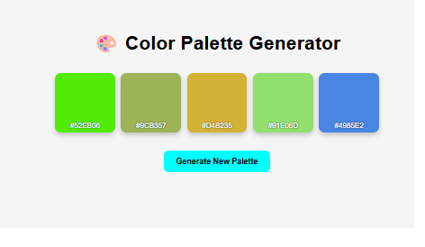

# Color Palette Generator

🎨 A clean and fun app to generate random color palettes with copy-to-clipboard functionality.

## 🌈 Features
- Generates 5 random hex colors
- Click on color to copy the hex code
- Responsive and modern design

## 📸 Preview

## 💡 Use Case
Perfect for designers, devs, or anyone needing fresh color inspiration.

## 💻 Tech Stack
- HTML5
- CSS3
- JavaScript (Clipboard API)

---

Made by [Santhiya Baskar](https://github.com/SanthiyaBaskar)
